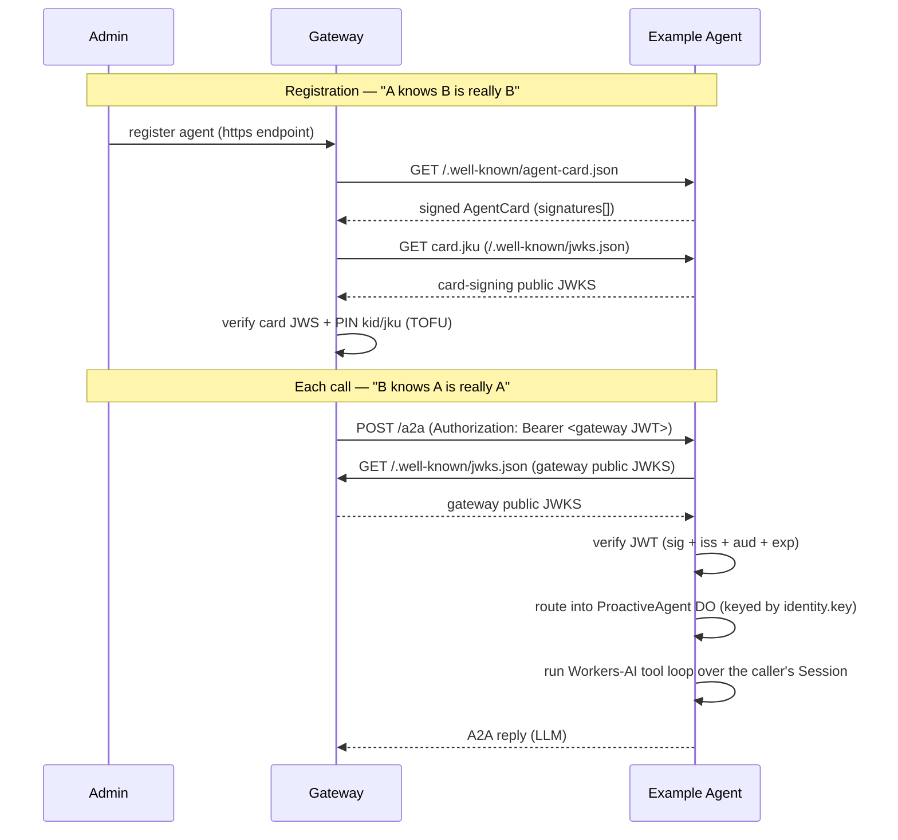

# Architecture

## The contract (both directions)

This agent therefore does three things:

1. **Serves a signed AgentCard** at `/.well-known/agent-card.json`. The card is
   signed with a detached-payload EdDSA flattened JWS over its **canonical JSON**
   (see [`src/a2a/canonical.ts`](src/a2a/canonical.ts)). The gateway verifies this and
   pins the signing key's `kid` + `jku` on first registration (Trust-On-First-Use).
2. **Publishes its card-signing public JWKS** at `/.well-known/jwks.json` (the
   card's `jku`), so the gateway can resolve the signing key.
3. **Verifies the gateway identity JWT** on every JSON-RPC call, resolving the
   gateway's public JWKS from the token's own `jku` header (RFC 7515 §4.1.2)
   and enforcing `iss`, `aud`, and `exp` against `GATEWAY_ORIGINS`.
   The verified caller identity is read from the namespaced
   `https://looping.ai/identity` claim and passed to the agent runtime.

> No secret is shared in either direction. The gateway proves it is the gateway
> with a signed JWT; this agent proves it is itself with a signed card. Each side
> only needs the other's **public** JWKS.

## Agent runtime (Durable Object + LLM tool loop)

Once the JWT is verified, [`src/index.ts`](src/index.ts) runs the A2A JSON-RPC
server for the call, and its [`A2AExecutor`](src/a2a/executor.ts) dispatches the
turn into the [`ProactiveAgent`](src/proactive-agent/index.ts) Durable Object with a
single native RPC call, passing the **verified** caller identity as a typed
argument — **one instance per calling gateway-agent**, keyed by the verified
`identity.key`. If the token carries no `key` the Worker refuses the call (400):
there is no shared/default instance to route to.

The DO is the agent runtime. It extends the Agents-SDK `Agent` (itself a genuine
`DurableObject` subclass), so the Worker reaches it with a single **native
Cloudflare RPC** call — `await stub.converse(text, identity)` — with no internal
HTTP or JSON-RPC layer: the DO is never exposed over the network, only reachable
from this Worker's own code. [`src/a2a/executor.ts`](src/a2a/executor.ts) is
the only A2A-protocol-aware piece on the Worker side: it extracts the inbound
text, calls `converse()` on the caller's DO, and publishes the single reply. The
DO backs a **Session** with `this.sql`:

- **One continuous Session per caller** ([`src/agent/session.ts`](src/agent/session.ts)):
  a read-only `"soul"` identity block + a writable `"memory"` scratchpad the model
  self-edits (via the Session `set_context` tool), plus history. All of a caller's
  turns — across every channel/thread — accumulate into this single conversation.
  The agent is built to be a **long-lived, proactive** partner, not a stateless
  request/reply bot; a future phase may have the DO speak _first_ (push
  notifications / alarm-driven outreach) rather than only replying inside a live
  A2A call — the `this.schedule` alarm and the card's `pushNotifications` flag are
  the seams for that.
- **Compaction** keeps the context lean: history is automatically compacted once
  it grows past `COMPACT_AFTER_TOKENS` (the Sessions `compactAfter` mechanism).
- **Model pair** ([`src/agent/model.ts`](src/agent/model.ts)): a primary + fallback
  Workers-AI model (via [`workers-ai-provider`](https://www.npmjs.com/package/workers-ai-provider)
  routed through an AI Gateway); also the compaction summarizer. Model ids, gateway
  slug, and Session tuning are constants in [`src/config.ts`](src/config.ts).
- **Turn loop** ([`src/agent/loop.ts`](src/agent/loop.ts)): `runTurn` appends the
  user turn to the Session, runs a bounded multi-step `generateText` loop
  (`stepCountIs(MAX_STEPS)`) over the Session history + soul + memory, persists the
  assistant reply, and returns the final reply text. Primary→fallback on error; a
  transient (capacity/timeout) or unexpected failure resolves to a friendly reply
  rather than throwing. [`ProactiveAgent.converse`](src/proactive-agent/index.ts) is the
  DO's one public RPC method — it wraps `runTurn` and returns its result.
- **Soul + caller context** ([`src/agent/prompt.ts`](src/agent/prompt.ts)): the frozen
  `"soul"` feeds the Session soul block; the verified caller is appended per turn as
  a system suffix. The prompt is aware of the gateway's `<turn>` provenance wrapper
  (parsed, never authored — see [`src/agent/history.ts`](src/agent/history.ts)).
- **Tools** ([`src/agent/tools.ts`](src/agent/tools.ts)): placeholder `whoami` /
  `echo` tools (merged over the Session's own `set_context`) that prove tool-calling
  end to end. `whoami` closes over the verified identity so it can't be spoofed.
  Real domain tools (with per-call authorization) come in a later phase.

Episodic recall (Vectorize) and real domain tools are subsequent phases (see
[`PLAN.md`](PLAN.md)); the Session compaction already exposes an `onArchive` seam
for recall to wire into.

## Canonical JSON (must match the gateway)

The card signature is computed over a deterministic serialization:

- object keys sorted recursively (ascending),
- `JSON.stringify` with no insignificant whitespace,
- the `signatures` field excluded,
- payload bytes = UTF-8, base64url (no padding) for the JWS.

[`src/a2a/canonical.ts`](src/a2a/canonical.ts) is a byte-for-byte copy of the gateway's
[`src/a2a/card-verify.ts`](https://github.com/Looping-AI/looping-gateway/blob/main/src/a2a/card-verify.ts) canonicalizer. **If you change one, change both.**

## Environment

| Variable          | Where   | Purpose                                                                                              |
| ----------------- | ------- | ---------------------------------------------------------------------------------------------------- |
| `A2A_SIGNING_KEY` | secret  | Ed25519 private JWK (with `kid`) that signs the AgentCard.                                           |
| `GATEWAY_ORIGINS` | secret  | JSON array of trusted gateway origins, e.g. `["https://gw.example.com"]`. Validates `jku` and `iss`. |
| `AI`              | binding | Workers AI binding (routed via AI Gateway) backing the LLM tool loop.                                |
| `ProactiveAgent`  | binding | Durable Object namespace — one instance per caller, holding the durable Session.                     |

## Files

| File                                                                 | Role                                                                                                         |
| -------------------------------------------------------------------- | ------------------------------------------------------------------------------------------------------------ |
| [`src/index.ts`](src/index.ts)                                       | Worker entry: card / JWKS; verifies JWT, then runs the A2A JSON-RPC server dispatching into the caller's DO. |
| [`src/a2a/card.ts`](src/a2a/card.ts)                                 | Build + sign the AgentCard; derive public JWKS; parse signing key.                                           |
| [`src/a2a/canonical.ts`](src/a2a/canonical.ts)                       | Canonical JSON contract (mirrors the gateway).                                                               |
| [`src/a2a/verify.ts`](src/a2a/verify.ts)                             | Verify the gateway identity JWT.                                                                             |
| [`src/proactive-agent/index.ts`](src/proactive-agent/index.ts)       | `ProactiveAgent` DO — owns the caller's Session; `converse()` RPC method answers turns.                      |
| [`src/agent/session.ts`](src/agent/session.ts)                       | The continuous Session (soul + memory + compaction).                                                         |
| [`src/a2a/executor.ts`](src/a2a/executor.ts)                         | `A2AExecutor` — thin A2A glue calling the caller's DO via native RPC.                                        |
| [`src/agent/loop.ts`](src/agent/loop.ts)                             | `runTurn` — Session turn runner (primary → fallback, transient handling).                                    |
| [`src/agent/model.ts`](src/agent/model.ts)                           | Workers-AI primary/fallback model pair (via AI Gateway).                                                     |
| [`src/agent/prompt.ts`](src/agent/prompt.ts)                         | Soul (identity + rules) + per-request caller context.                                                        |
| [`src/agent/tools.ts`](src/agent/tools.ts)                           | Placeholder `whoami` / `echo` tools (pure handlers + AI-SDK wiring).                                         |
| [`src/a2a/inbound.ts`](src/a2a/inbound.ts)                           | Inbound A2A message → text (`textOf`) — the one place touching the `@a2a-js/sdk` message shape.              |
| [`src/agent/history.ts`](src/agent/history.ts)                       | `<turn>` provenance parsing + Session-history message glue (no A2A types).                                   |
| [`src/config.ts`](src/config.ts)                                     | Model ids, AI Gateway slug, loop bound, Session/compaction tuning.                                           |
| [`src/proactive-agent/manifest.ts`](src/proactive-agent/manifest.ts) | AgentCard identity + advertised skills.                                                                      |
| [`scripts/generate-keys.mjs`](scripts/generate-keys.mjs)             | Ed25519 JWK keypair generator.                                                                               |
